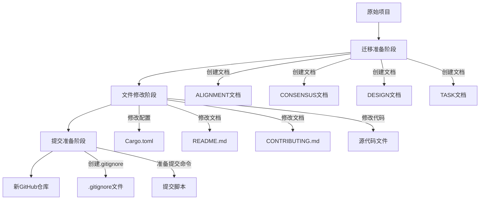
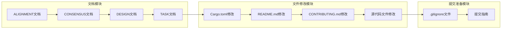

# 项目迁移设计文档

## 整体架构图



## 分层设计和核心组件

### 1. 迁移准备层

**职责**：
- 创建迁移相关的文档
- 分析项目结构和需要修改的文件
- 定义迁移的范围和边界

**核心组件**：
- ALIGNMENT_项目迁移.md：定义项目对齐信息
- CONSENSUS_项目迁移.md：定义项目共识信息
- DESIGN_项目迁移.md：定义项目设计信息
- TASK_项目迁移.md：定义项目任务分解

### 2. 文件修改层

**职责**：
- 修改项目的配置文件
- 更新项目文档
- 修改源代码中的引用信息

**核心组件**：
- Cargo.toml：项目配置文件
- README.md：项目说明文档
- CONTRIBUTING.md：贡献指南
- 源代码文件：可能包含项目引用信息的源文件

### 3. 提交准备层

**职责**：
- 准备项目提交到新GitHub仓库
- 创建或更新.gitignore文件
- 提供提交命令和流程指导

**核心组件**：
- .gitignore文件：Git忽略规则
- 提交指南：指导用户如何提交到新仓库

## 模块依赖关系图



## 接口契约定义

### 1. 文档接口

**ALIGNMENT到CONSENSUS**：
- 输入：项目上下文分析、需求理解、决策策略
- 输出：明确的需求描述、验收标准、技术实现方案

**CONSENSUS到DESIGN**：
- 输入：需求描述、验收标准、技术实现方案
- 输出：整体架构图、分层设计、模块依赖关系图、数据流向图

**DESIGN到TASK**：
- 输入：整体架构、模块划分
- 输出：子任务拆分、任务依赖图、输入输出契约

### 2. 文件修改接口

**配置文件修改**：
- 输入：新的项目名称
- 输出：更新后的Cargo.toml文件

**文档修改**：
- 输入：新的项目名称、新的GitHub仓库URL、新的作者信息
- 输出：更新后的README.md、CONTRIBUTING.md等文档

**源代码修改**：
- 输入：原项目信息、新项目信息
- 输出：更新后的源代码文件

## 数据流向图

```mermaid
digraph D {
    A[原始项目信息] -> B[文档创建]
    B -> C[需求分析]
    C -> D[文件修改计划]
    D -> E[配置文件修改]
    D -> F[文档修改]
    D -> G[源代码修改]
    E -> H[更新后的项目]
    F -> H
    G -> H
    H -> I[新GitHub仓库]
}
```

## 异常处理策略

### 1. 文件不存在
- **检测方法**：在修改文件前检查文件是否存在
- **处理策略**：如果文件不存在，记录警告并跳过该文件的修改

### 2. 文件格式错误
- **检测方法**：检查文件格式是否符合标准（如TOML、Markdown等）
- **处理策略**：确保修改后的文件格式正确，避免引入语法错误

### 3. 链接无效
- **检测方法**：检查文档中的链接格式是否正确
- **处理策略**：确保所有链接都更新为指向新仓库的有效链接

### 4. 编译错误
- **检测方法**：由于当前环境未安装Rust编译器，无法直接检测编译错误
- **处理策略**：确保修改仅涉及元数据和引用信息，不修改核心代码逻辑，并在提交指南中提醒用户进行编译测试

## 设计原则

1. **最小化修改**：仅修改必要的元数据和引用信息，不修改核心功能代码
2. **保持一致性**：确保所有文档和配置文件中的项目信息保持一致
3. **保持许可证**：继续使用原项目的GPLv3许可证
4. **保持完整性**：确保修改后的项目能够保持原有的功能完整性
5. **文档同步**：确保所有修改都有相应的文档记录